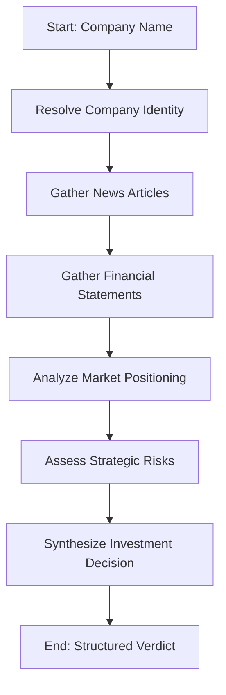

# FinSight AI - Investment Research Agent

An autonomous, multi-step investment research agent that evaluates companies and synthesizes structured **Invest / Pass / Watch** recommendations with confidence metrics, cited sources, and step-by-step agent reasoning trails.

Built with **Next.js 15+ (App Router)**, **TypeScript**, **LangGraph**, and **Tailwind CSS**.

---

## 🏗️ Technical Architecture

The core of the application is powered by a stateful workflow graph using LangGraph. It runs sequentially through specialized nodes to gather data, analyze context, audit risk, and synthesize a final decision:



### State Management & Recovery
1. **Identity Resolution**: Standardizes brand names into registered corporate entities (e.g., "Tesla" ➔ "Tesla, Inc.") and identifies whether they are public or private.
2. **Resilient Data Collection**: The financials node attempts to load fundamental metrics using **Alpha Vantage**. If Alpha Vantage is unavailable, rate-limited, or fails, the graph automatically falls back to conducting targeted web queries via **Tavily** to build a comprehensive financial overview.
3. **Structured Outputs**: All critical decision nodes enforce strictly validated schemas using **Zod** (e.g. `RiskAssessmentSchema`, `DecisionSchema`) ensuring reliable data extraction from LLMs.

---

## 🛠️ Features & Design

- **Real-Time Stream Processing**: Utilizes **Server-Sent Events (SSE)** to stream intermediate node execution updates to the frontend in real time, showing the exact steps the agent is taking.
- **Strict Light Mode UI**: Clean, premium aesthetic with subtle shadows, rich margins, high typography contrast, and animated timelines/steppers.
- **Robust SWOT & Risk Analysis**: Displays detailed tabular market intelligence containing Strengths, Weaknesses, Opportunities, and Threats alongside categorized severity risks (Regulatory, Concentration, Financial).
- **Fully Cited Source Audits**: Links directly back to SEC filings, financial databases, and news articles used to form the thesis.

---

## ⚙️ Setup & Installation

### 1. Clone & Install Dependencies
```bash
npm install
```

### 2. Configure Environment Variables
Create a `.env` file in the root directory (based on `.env.example`):
```env
LLM_PROVIDER=gemini
GOOGLE_API_KEY=your-gemini-api-key
TAVILY_API_KEY=your-tavily-api-key
ALPHA_VANTAGE_API_KEY=your-alpha-vantage-api-key
```

### 3. Run the Development Server
```bash
npm run dev
```
Open [http://localhost:3000](http://localhost:3000) (or specified port) to interact with the application.

### 4. Build for Production
```bash
npm run build
```

---

## 💡 Key Decisions & Trade-offs

- **Model Shift (`gemini-2.5-flash`)**: Transitioned the core LangGraph LLM to `"gemini-2.5-flash"`, which was tested and verified to have operational quota and fast response times.
- **Proxy/Network Resilience**: Integrated a customized `fetchWithRetry` wrapper to protect tool queries (like Tavily) against network errors (such as `502 Bad Gateway` / `Too many open files`) triggered by local SSL inspection utilities.
- **Folder Restructuring**: Relocated the `/lib` directory inside `/src` to ensure Next.js path resolution (`@/lib/...`) resolves correctly without typescript compiler configuration issues.

---

## 🔧 Troubleshooting

### TLS/SSL Handshake Errors
If you're on a network with an SSL-inspecting firewall/antivirus (common on corporate or campus networks) and see TLS handshake errors (`self-signed certificate in certificate chain`), export your network's root CA certificate as a `.pem` file and set the `NODE_EXTRA_CA_CERTS` environment variable to its path:

```bash
# Windows PowerShell
$env:NODE_EXTRA_CA_CERTS="C:\path\to\your\root_ca.pem"
npm run dev

# Linux / macOS
NODE_EXTRA_CA_CERTS="/path/to/your/root_ca.pem" npm run dev
```

---

## 📊 Example Runs

*Note: due to the Gemini free-tier's daily request quota being exhausted during final testing, only one live example run is included here. The pipeline was also verified working end-to-end on Apple and a private company (Tata Group) during development — see the build transcript for those runs.*

### Example 1: Tesla, Inc.
**Input**: "Tesla"
**Agent Flow**: 
- Resolved to "Tesla, Inc." (Public, TSLA).
- Gathered recent news on Q3 earnings, Cybertruck production, and Robotaxi events.
- Pulled latest income statement metrics via Alpha Vantage.

**Synthesized Output:**
```json
{
  "verdict": "WATCH",
  "confidenceScore": "medium",
  "reasons": [
    {
      "text": "High valuation multiples combined with declining automotive gross margins present short-term headwinds.",
      "sourceNode": "analyzeMarket"
    },
    {
      "text": "Strong cash position and leadership in EV infrastructure and autonomy software provide long-term upside potential.",
      "sourceNode": "synthesizeDecision"
    }
  ],
  "keyRisks": [
    "Regulatory scrutiny over Full Self-Driving claims.",
    "Increased competition in the Chinese EV market."
  ],
  "sourcesUsed": [
    "https://www.reuters.com/business/autos-transportation/...",
    "Alpha Vantage Financials (TSLA)"
  ]
}
```

---

## 🚀 What I'd Improve with More Time

1. **Persistent Caching Layer**: Implement Redis or a database (e.g., PostgreSQL/Supabase) to cache API responses (Alpha Vantage, Tavily) to drastically reduce LLM provider costs and rate limits for commonly searched companies.
2. **Enhanced SEC Parsing**: Build a dedicated tool to pull and vector-search raw 10-K/10-Q filings from the SEC EDGAR database to provide deeper, hallucination-free fundamentals context.
3. **User Authentication & Portfolios**: Allow users to log in, save previous research runs, and build a "Watchlist" that automatically refreshes research on a weekly basis.
4. **Agentic Reflection Node**: Add a self-correction loop in the LangGraph setup where the agent reviews its own verdict for bias or missing evidence before finalizing the stream.
